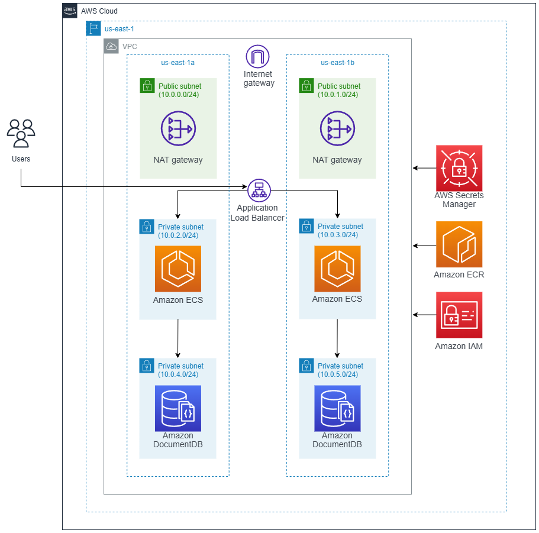

# Prueba Técnica - DevOps Engineer

## 1) ¿Cuál es la diferencia entre Infrastructure as Code (IaC) y Configuration Management? 

La diferencia entre Infrastructure as Code (IaC) y Configuration Management es que IaC se usa para crear toda la infraestructura automáticamente, como servidores (EC2) o recursos (resource) en la nube, usando código. Por ejemplo, como lo son terraform y AWS CloudFormation. En cambio, Configuration Management se encarga de poner en orden y mantener los recursos, asegurándose de que tengan las aplicaciones correctas, actualizaciones y configuraciones necesarias. Por ejemplo, como lo son Ansible y Puppet. Ambos métodos se complementan y en muchas compañias se utilizan juntos para automatizar todo el proceso de infraestructura y referencia.

## 2) Crear un Dockerfile que sirva una aplicación HTTP sencilla en /health devolviendo "OK". Debe estar contenido dentro de docker-compose.yml junto a cadvisor o node-exporter.

Dockerfile para aplicación HTTP en /health devolviendo "OK":

```dockerfile
FROM python:3.9-slim
# Crear un directorio para la app
WORKDIR /app            
# Crear el archivo app.py
RUN echo "from flask import Flask\napp = Flask(__name__)\n\n@app.route('/health')\ndef health():\n    return 'OK'\n\nif __name__ == '__main__':\n    app.run(host='0.0.0.0', port=80)" > app.py
# Instalar Flask
RUN pip install --no-cache-dir flask
# Exponer el puerto
EXPOSE 80
# Comando para correr la app
CMD ["python", "app.py"]
```

Archivo docker-compose.yml

```yml
version: '3'

services:
  health-app:
    build: .
    ports:
      - "80:80"
    volumes:
      - ./app:/app

  cadvisor:
    image: gcr.io/cadvisor/cadvisor:latest
    restart: always
    ports:
      - "8080:8080"
    volumes:
      - /:/rootfs:ro
      - /var/run:/var/run:ro
      - /sys:/sys:ro
      - /var/lib/docker/:/var/lib/docker:ro
```

## 3) Explica qué hace este manifiesto de Kubernetes: 

```yml
apiVersion: v1 
kind: Service 
metadata: 
  name: my-service 
spec: 
  selector:
    app: my-app 
  ports: 
    - port: 80 
      targetPort: 8080 
```

A continuación se explica el manifiesto de Kubernetes:

```yml
apiVersion: v1          # Versión de la API de Kubernetes a utilizar
kind: Service           # Indica el recurso que se está creando, en este caso un Servicio
metadata:               # Contiene información descriptiva sobre el servicio
  name: my-service      # Asigna nombre al servicio, en este caso "my-service"
spec:                   # Define características y configuraciones del servicio
  selector:             # Indica que pods deben ser seleccionados y gestionados por este servicio
    app: my-app         # Solo los pods con "my-app" serán alcanzados por este servicio
  ports:                # Puertos que el servicio expondrá y redirigirá
    - port: 80          # Puerto en el que el servicio será accesible dentro del clúster de Kubernetes
      targetPort: 8080  # Puerto donde los pods son accesibles: tráfico que llegue al puerto 80 del servicio será redirigido al puerto 8080 de los pods seleccionados
```

En resumen, este manifiesto crea un servicio que expone los pods etiquetados con "my-app" a través del puerto 80, enrutando este tráfico al puerto 8080 donde se están ejecutando las aplicaciones en esos pods. 

## 4) Escribe un pipeline que:

- Haga build de un contenedor
- Ejecute tests simulados (echo OK)
- Haga push (simulado o real) a un registry local
- Despliegue en staging (usando docker-compose)

```yml
name: Validate, Build and Deploy App

on:
  push:
    branches:
      - main 
  
jobs:

  build:
    runs-on: ubuntu-latest

    steps:
      - name: Checkout repository
        uses: actions/checkout@v3

      - name: Log in to Docker registry
        run: echo "${{ secrets.DOCKER_PASSWORD }}" | docker login -u "${{ secrets.DOCKER_USERNAME }}" --password-stdin localhost:5000

      - name: Build Docker image
        run: |
          docker builder prune -a -f
          docker build -t localhost:5000/my-app:latest .
          docker push $IMAGE_URL --all-tags 

      - name: Run simulated tests
        run: |
          echo "OK"

      - name: Push Docker image
        run: |
          docker push localhost:5000/my-app:latest

      - name: Deploy with docker-compose
        run: |
          docker-compose -f docker-compose_staging.yml up -d
```

## 5) ¿Qué es una SLI y cómo se relaciona con un SLO? Propón una alerta realista para una  API crítica.

Una SLI (Service Level Indicator) es una métrica que se utiliza para medir qué tan bien funciona un servicio. Puede ser, por ejemplo, el porcentaje de peticiones que son exitosas, cuánto tarda en responder o cuánto tiempo está disponible el sistema. Por otro lado, un SLO (Service Level Objective) es un objetivo o meta que se ha trazado para ese indicador. Por ejemplo, una alerta crítica realista para una API puede ser validar si la misma está funcionando correctamente, esto puede ser definir una SLI que mida la tasa de errores y un SLO que establezca que esa tasa no debe superar el 2% en un período de 5 minutos. La SLI da los datos concretos (una métrica), como el porcentaje real de errores en ese tiempo y el SLO da la meta que se quiere alcanzar para mantener la API en un estado confiable.

## 6) Tu contenedor Docker reinicia en bucle al hacer docker-compose up. ¿Qué harías para identificar el problema?

Haría lo siguiente:

1-Ver el estado de los contenedores ejecutador con docker-compose up: usar 'docker-compose ps -a' para comprobar el estado de los contenedores y ver si hay algún mensaje que indique que pueda estar ocurriendo con los mismos

2-Revisar los logs y probar en modo interactivo: ejecutar 'docker-compose logs <nombre_servicio>' para ver qué mensajes de error o advertencias aparecen justo antes de que se reinicien los contenedores que se estén revisando y probar levantar los contenedores en modo interactivo 'docker-compose run -it <servicio> /bin/bash' para ver si arranca correctamente y detectar errores más fácilmente

3-Verificar la configuración del Docker Compose: revisar el archivo docker-compose.yml y validar que las configuraciones (puertos, variables de entorno, volumenes, etc) sean correctos

4-Validar recursos de los contenedores: verificar si los contenedores tiene suficiente memoria, disco y recursos, y que esto no sea lo pueda estar causando reinicios o fallos

5-Revisar errores de aplicación: puede que el reinicio venga de la aplicación que este faltando alguna configuración de la misma como dependencias, variables de entorno, entre otros 


## 7) Diseña una arquitectura básica en AWS para servir una aplicación web con alta disponibilidad,escalabilidad y bajo coste. Menciona al menos 3 servicios principales que usarías y cómo se conectan.



La arquitectura presentada tiene:

- AWS VPC: la VPC se implementa con 6 subredes, 2 subredes públicas, 2 subredes privadas y 2 subredes de bases de datos privadas. Las subnets públicas se crea el Internet Gateway (IG) y se configura el Route Table de estas subnets con el IG para tener acceso a internet. Para las subnets privadas se configura el Route Table de las mismas con el  NAT Gateway para tener acceso a internet indirectamente desde este dispositivo que se encuentra hosteado en las subnet públicas.

- AWS ALB: application load balancer que distirbuye el tráfico de internet hacia la aplicación en las dos zonas de disponibilidad.

- Amazon ECS con Fargate: la aplicación se implementan en AWS ECS en una configuración sin servidor (Fargate) en dos zonas de disponibilidad. La configuración de ECS se comunica constantemente con Amazon IAM, Amazon EC2 y Amazon Secrets Manager. ECS se comunica con IAM para autorizar a ECS a extraer la imagen de la aplicación de ECR y enviarlas a ECS. Además, se crea un rol de IAM para acceder a los contenedores y realizar pruebas. ECS se comunica con Secrets Manager para obtener las credenciales de la base de datos DocumentDB.

- Amazon DocumentDB (con compatibilidad MongoDB): base de datos no relacional con 2 instancias para cada una de las zonas de disponibilidad.

- AWS ECR: registro para almacenar la imagen de la aplicación.

- Amazon IAM: roles creados para permitir la autenticación y autorización entre servicios.

- AWS Secrets Manager: almacenar las credenciales de la base de datos DocumentDB.

En resumen, al recibir una solicitud desde la Web esta solicitud ingresa a la VPC directamente al AWS Application Load Balancer (ALB) que decide distribuye el tráfico hacia la aplicación AWS ECS a las dos replicas que se tiene cada una en una zona de disponibilidad, de existir algún fallo en una de las zonas de disponibilidad todo el tráfico se enruta a la zona disponible en ese momento. De igual forma, el servicio de AWS ECS se configura para contar con una configuración de escalado horizontal que implica al encontrarse a sus maximas capacidades de cpu y memoria, se realiza una replica de ese mismo pod en cada una de las zonas de disponilidad. Posteriormente, para conectarse a la base de datos desde la aplicación se configura el endpoint de la base de datos MongoDB y asi poder escribir/leer información de la misma. 

## 8) ¿Has utilizado Inteligencia Artificial (ChatGPT, Cursor, Claude...)? Si es así, ¿qué prompts has usado?

Sí, he utilizado diferentes herramientas de Inteligencia Artificial la app de Chatbot que incluye varios modelos como ChatGPT, Claude, entre otro. También, he utilizado CoPilot para tareas de asistencia en mi código de Visual Studio Code. Algunos de los prompts que he usado son preguntas específicas sobre temas técnicos y consultas para entender conceptos complejos. 

## 9) Bonus técnico:

- Añadir un Makefile con tareas make up, make down, make test.
- Añadir tests unitarios simples (si usa Python o Node).
- Simular métricas de sistema con Prometheus + Grafana.

A continuación, se presenta el Makefile:

```makefile
COMPOSE = docker-compose -f docker-compose.yml    # comando docker-compose junto con nombre archivo

up: # comando para arrancar los servicios
    $(COMPOSE) up -d

down: # comando para parar los servicios y eliminar contenedores
    $(COMPOSE) down

test: # comando para ejecutar pruebas o comandos de test con Python
    $(COMPOSE) run app pytest
    cd tests && pytest 
```

Ahora, los tests unitarios simples con Python (tests/test_sample.py):

```python
def suma(a, b):
    return a + b

def test_suma():
    assert suma(2, 3) == 5
```

Para ejecuatr las tareas del Makefile, se realiza con los comandos:

```
make up
make down
make test
```

Simular métricas de sistema con Prometheus + Grafana (metrics_server.py):

```Python
from prometheus_client import start_http_server, Gauge
import random
import time

cpu_gauge = Gauge('simulated_cpu_usage', 'CPU usage percentage')

if __name__ == '__main__':
    start_http_server(8000)  # Puerto donde se expondrán las métricas
    while True:
        cpu_gauge.set(random.uniform(0, 100))
        time.sleep(5)
```